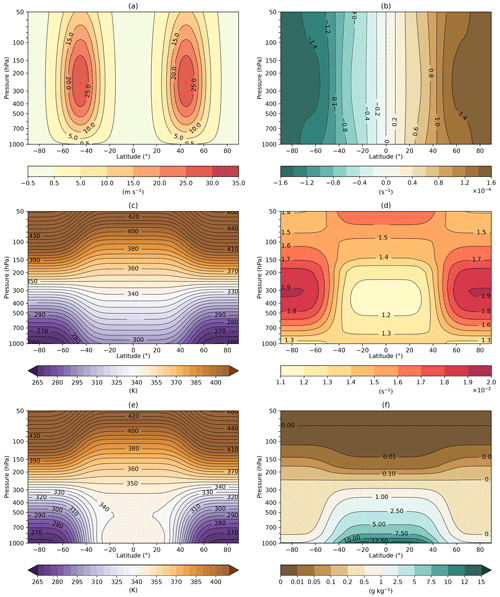
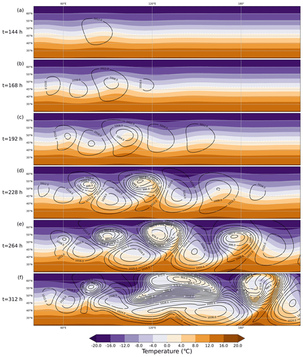

# Bouvier et al. (2024) Moist Baroclinic Wave Test

This experiment runs either SFNO or GraphCast using an idealized, zonally-symmetric (unless perturbed) aquaplanet initial condition.  The initial condition is designed to be baroclinically unstable, such that perturbing the initial condition should spontaneously result in the growth of a baroclinic wave. The initial condition protocol for this experiment was designed by Clement Bouvier: a DCMIP 2025 attendee! This experiment aims to satisfy both objectives (2) and (3): *run idealized simulations with these two models to probe aspects of the models' physical fidelity; and explore and intercompare model responses as the model inputs stray further and further from their training dataset*.

## Instructions

The scripts/notebooks in this folder are labeled and arranged in the order in which they should be modified and/or run.

### `0.config.yaml`
The `0.config.yaml` file contains variables that can be configured to modify the behavior of the simulation.

### `1.prep_output_dir.py`
Run this script to prepare the experiment directory that you specified in the last step.

### TODO - fill out next steps

TODO

## Details

This test uses initial conditions from [Bouvier et al. (2024)](https://doi.org/10.5194/gmd-17-2961-2024), who derived a set of initial conditions for an aquaplanet model that are conditionally unstable.  The ICs are defined such that if they are perturbed, a model should produce a baroclinic wave. This test is designed to assess whether machine learning models produce baroclinic waves in response to such an IC in the same way that traditional dynamical cores do.

The unperturbed Bouvier et al. initial conditions (copied from their paper) are shown below:

The response of the OpenIFS model to a perturbed version of these initial conditions follows:

